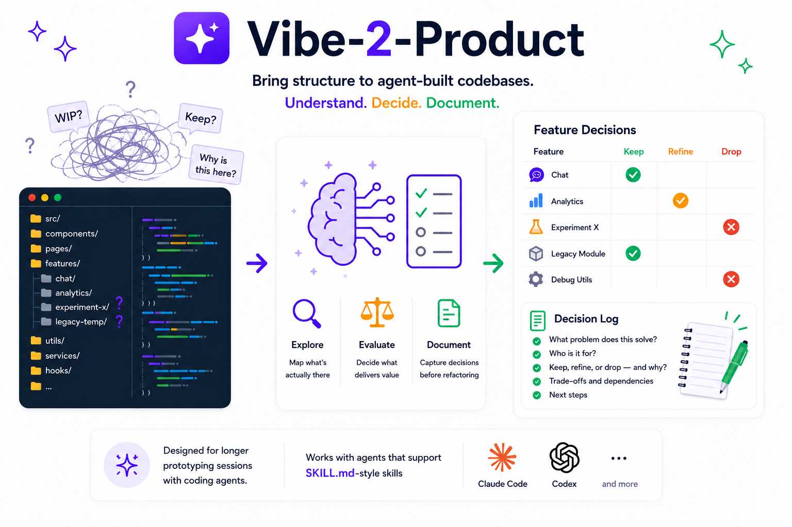

# Vibe 2 Product

An agent skill for turning an unclear existing codebase into explicit product
decisions.

It walks through a repository feature by feature, explains what is actually
implemented, asks for one decision at a time, and records each decision in a
markdown log.



## Why

After a long agentic vibe coding session, the codebase often
contains a mix of useful features, half-finished ideas, placeholders, and
accidental complexity.

Vibe 2 Product creates a structured refinement pass before implementation work
continues, so you can decide what should be kept, refined, or removed.

## What It Does

- Maps the codebase before asking for decisions.
- Explains one feature at a time in plain technical language.
- Distinguishes real behavior from placeholder, toy, or internal code.
- Asks for exactly one decision per feature: keep, refine, or drop.
- Records every decision in a persistent markdown log.
- Uses the decision log as the source of truth for later implementation.

## Good Use Cases

- Refining a vibe-coded prototype.
- Reviewing a codebase produced by a long-running coding-agent goal.
- Understanding an inherited project before cleanup.
- Turning scattered generated features into a product roadmap.
- Separating useful functionality from accidental complexity.

## Compatibility

This is a plain `SKILL.md` skill following the common Agent Skills shape:

```text
vibe-2-product/
└── SKILL.md
```

It should work with coding agents that support filesystem skills based on
`SKILL.md`, including Claude Code and Codex. The workflow itself is not tied to
any one agent.

The main differences are where each agent expects skills to live and how you
invoke them.

## Install

The easiest option is to ask your coding agent to install the skill from this
repository:

```text
Install the Agent Skill from https://github.com/marvinseyfarth1/vibe-2-product
and make it available as vibe-2-product. Use the appropriate skills directory
for this agent.
```

You can also clone it manually into the skills folder for your agent.

Claude Code personal skill:

```bash
git clone https://github.com/marvinseyfarth1/vibe-2-product.git ~/.claude/skills/vibe-2-product
```

Claude Code project skill:

```bash
git clone https://github.com/marvinseyfarth1/vibe-2-product.git .claude/skills/vibe-2-product
```

Codex personal skill:

```bash
git clone https://github.com/marvinseyfarth1/vibe-2-product.git ~/.agents/skills/vibe-2-product
```

Codex project skill:

```bash
git clone https://github.com/marvinseyfarth1/vibe-2-product.git .agents/skills/vibe-2-product
```

Restart your agent if the skill does not appear immediately.

## Usage

Ask your agent to use Vibe 2 Product:

```text
Use Vibe-2-Product to walk me through this codebase.
```

If your agent supports explicit skill invocation, use the installed skill name:

```text
vibe-2-product
```

## Decision Log

The skill prefers a repo-local file such as:

```text
docs/vibe-2-product-decisions.md
```

See [examples/vibe-2-product-decisions.md](examples/vibe-2-product-decisions.md)
for the expected shape.

## License

MIT
